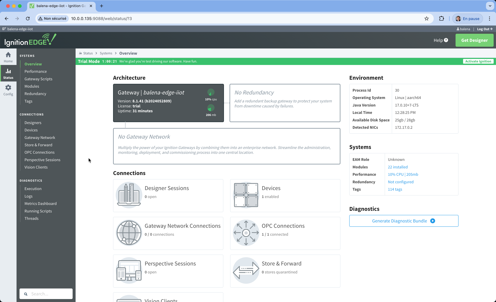

# Based on the previous work of IoT Giant Marc https://marcpous.com

# SCADA Ignition on balena

In this repository, we're going to delve into how to deploy Inductive Automation Ignition SCADA on balena in order to run the SCADA solution on your Industrial stack. Take advantage of using balena to have flexibility running other services in your industrial stack on simple devices running within your factory.

## Disclaimer

This project is for educational purposes only. Do not deploy it into your premises without understanding what you are doing. USE THE SOFTWARE AT YOUR OWN RISK. THE AUTHORS AND ALL AFFILIATES ASSUME NO RESPONSIBILITY FOR YOUR SECURITY.

We strongly recommend you to have some coding, security and networking knowledge. Do not hesitate to read the source code and understand the mechanism of this project or contact the authors.

## Deploy Ignition on balena

Running this project is as simple as deploying it to a balenaCloud application. But before some context.

### Understanding SCADA and the Industry 4.0

Before we dive into Ignition, let's define SCADA. SCADA means `Supervisory Control and Data Acquisition`. SCADA is a system employed across industries to supervise, control, and manage complex processes and infrastructure in real-time. It combines hardware and software components to collect real-time data from remote devices, facilitate centralized control, and foster efficient decision-making. SCADA systems are predominant in sectors such as manufacturing, energy, water treatment and transportation among others.

Ignition is a SCADA software by Inductive Automation®. It simplifies the development and deployment of web-based SCADA UI systems, making them accessible from anywhere. Ignition is initially designed to connect industrial data following the OPC UA modelization. 

In this post, we'll be focusing on deploying [Ignition Edge](https://inductiveautomation.com/ignition/edge) on balena, demonstrating how easily you can maintain an IIoT edge gateway running Ignition Edge, whether updating the Ignition version, other services running along Ignition Edge or the host OS of the gateway. 

### Deploy the project

#### Hardware

* This fork is tested with Raspberry PI4
* Intel NUC or similar (x86 - amd64)
* USB stick to flash the balenaOS image on the Intel device

#### Software

* A balenaCloud account (sign up here) and get the first 10 devices free.

* [balenaEtcher](https://etcher.balena.io/) to flash the USB stick with the balenaOS image.

* [Ignition SCADA license](https://inductiveautomation.com/downloads/ignition/) or just use the trial demo which is free for 2 hours. After that you will need to restart the service running on the device.

As usual, you have three options here. Use balenaHub, click the “Deploy with balena” button or use the balena CLI. You can do it in just one click by using the button below:

Follow instructions, click Add a Device and flash an SD card with that OS image dowloaded from balenaCloud. Enjoy the magic 🌟Over-The-Air🌟!

Alternatively find the application on the balena IoT Edge marketplace [balenaHub](https://hub.balena.io) called [ignition](https://hub.balena.io/apps/2048634/ignition-balena).

### Log in to Ignition

The Ignition service is exposed in the 9088 port.

|Service|Port|Username|Password|
|:--|---|---|---|
|Ignition|9088 (http)|balena|balena|

#### Install Ignition

Once deployed on your balena device, access your local IP address and add port `9088`. 

